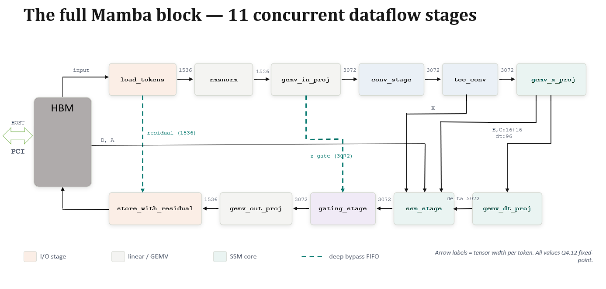

# Mamba on FPGA: a complete Mamba block on the Xilinx Alveo U55N

An FPGA implementation of a full **Mamba** (selective state-space) block, written in **Vitis HLS** and verified element-wise against the reference PyTorch model. The design is intended as a reproducible reference implementation. The priority is correctness and determinism rather than maximum throughput.

> Diploma project, Universitatea Politehnica București, Faculty of Automatic Control and Computers, 2026.
> Author: **Theodhoraq Mihallari** · Advisor: Prof. dr. ing. Gheorghe Decebal Popescu



## Overview

Mamba is a state-space alternative to the Transformer. Instead of attention, which scales quadratically with sequence length, it maintains a small fixed-size recurrent state updated token by token. This gives linear-time scaling and constant memory usage with competitive accuracy. The architecture is used in production hybrid models from NVIDIA, IBM, and Mistral, which makes hardware acceleration of the state-space computation relevant.

This project implements one full Mamba block (out of the 48 in the 790M model) as a fully pipelined hardware accelerator and validates it on real hardware.

- **Target:** Xilinx Alveo U55N (HBM), Vitis HLS
- **Model:** `state-spaces/mamba-790m`, block 0
- **Precision:** Q4.12 fixed-point datapath, INT8 weight storage
- **Verification:** element-wise comparison against golden input/output tokens captured from the reference model

## Results (measured on hardware)

| Metric | Value |
|---|---|
| Correctness | **5 / 5** golden tokens pass, max error **0.235** (tolerance 0.25) |
| Determinism | **CV ≈ 0%** (σ = 16.65 µs over 632.82 ms) |
| Kernel latency | **632.82 ms** per 32-token batch |
| End-to-end | 633.00 ms (PCIe transfer < 0.18 ms) |
| Throughput | 50.6 tokens/s per block |
| Clock | 287.7 MHz achieved (300 MHz target) |
| Utilization | 22% LUT · 28% BRAM · 13% DSP |
| Power | +7.18 W over idle · 15.14 W board · 37 °C junction |

## Repository structure and usage

The four main source files:

- **`host.cpp`**: the XRT host application. Loads the bitstream, dequantizes the INT8 `.mem` weights to Q4.12, allocates the HBM buffers, launches the kernel, and checks the output against the golden reference tokens.
- **`kernel.cpp`**: the Vitis HLS kernel. Contains all eleven dataflow stages of the Mamba block.
- **`main.py`**: downloads the `mamba-790m` checkpoint, extracts the block 0 weights, quantizes them to INT8, and writes all `.mem` files. It also captures the golden input/output token pairs used for verification.
- **`tb.cpp`**: the C simulation testbench for the kernel. It mimics the host flow (load weights, feed tokens, compare against golden outputs) but runs entirely in simulation, without hardware.

NOTE: Make sure to check the requirements.txt file, you need everything from there

### Running the simulation

Generate the weight and golden files first, then run the HLS testbench:

```
python main.py
vitis_hls -f run_tb.tcl
```

### Running on hardware

Requires an Alveo U55N with XRT and the Vitis toolchain installed.

```
make all
./host *.xclbin
```

`make all` builds the bitstream, which takes several hours. The host takes the `.xclbin` path as its only argument and reports the per-token verification result and the timing measurements.

## Architecture

The block runs as a dataflow pipeline of 11 concurrent stages connected by on-chip FIFOs. A token flows through:

```
load → rmsnorm → in_proj → conv → x_proj / dt_proj
     → ssm (selective scan) → gating → out_proj → + residual
```

All stages run concurrently: while one stage processes token $N$, the next is already processing token $N-1$. Two deep bypass FIFOs carry the residual connection and the gating signal across most of the pipeline. 

## Numerics

### Weight quantization

Weights are quantized offline to symmetric per-tensor INT8, then dequantized to Q4.12 when the host loads them:

$$
s = \frac{\max |W|}{127}
$$

$$
W_{\mathrm{int8}} = \mathrm{clip}\left(\mathrm{round}\left(\frac{W}{s}\right), -128, 127\right)
$$

$$
\hat{W} = \frac{\mathrm{round}\left(s \cdot W_{\mathrm{int8}} \cdot 2^{12}\right)}{2^{12}}
$$

The scheme is symmetric and per-tensor, with no per-channel scales and no calibration. This is the simplest possible scheme and was chosen for reproducibility. The hardware sees one uniform Q4.12 format throughout.

### Fixed-point formats

The datapath is 16-bit Q4.12, with wider types where range demands it:

- `data_t = ap_fixed<16,4>`: Q4.12, activations and weights, range $[-8, 8)$
- `acc_t  = ap_fixed<40,20>`: Q20.20, GEMV accumulators (sums of up to 1536 terms)
- `ssm_t  = ap_fixed<32,16>`: Q16.16, the recurrent hidden state

### Nonlinear functions

Nonlinearities can be evaluated by a 1024-entry lookup table:

$$
\mathrm{idx} = \left\lfloor \frac{x - x_{\min}}{x_{\max} - x_{\min}} \cdot (N-1) \right\rfloor,
\qquad
y = \mathrm{table}\big[\mathrm{clip}(\mathrm{idx}, 0, N-1)\big]
$$

Only SiLU uses its table (in `conv_stage`). Softplus and exp are computed directly in floating point, as $\log(1 + e^x)$ and `hls::exp` respectively, for accuracy. Their lookup tables exist in the code but are unused and remain available as a future optimization.

To keep the hardware output bit-for-bit identical to the reference, the GEMV accumulation loops are left as sequential DSP chains (no forced `II=1`), so the fixed-point rounding order matches the software exactly.

## Constants

All constants are defined in the shared header and kept in sync across the Python generator, the host, and the kernel.

**Model dimensions** (fixed by the Mamba-790M architecture, read from the checkpoint):

| Constant | Value | Meaning |
|---|---|---|
| `D_MODEL` | 1536 | model / residual-stream width |
| `D_INNER` | 3072 | inner width after in-projection (2 × D_MODEL) |
| `D_STATE` | 16 | SSM state size per channel |
| `D_CONV` | 4 | depthwise convolution kernel size (current + 3 past tokens) |
| `DT_RANK` | 96 | rank of the $\Delta$ (delta) projection bottleneck (D_MODEL / 16) |
| `SEQ_LEN` | 32 | sequence length processed per run |

**Parallelism** (hardware tuning parameters chosen for this design):

| Constant | Value | Meaning |
|---|---|---|
| `PAR` | 4 | unroll factor for reductions / GEMV inner loops |
| `ROW_PAR` | 2 | row-tiling factor in `gemv_in_proj` |
| `CHAN_PAR` | 2 | channels processed in parallel in `conv_stage` |

## Pipeline stages

The eleven stages, in dataflow order. Formulas use per-token, per-channel notation.

**1. `load_tokens`** reads the input batch from HBM and forks each value into the main pipeline and a deep residual FIFO held until the final add.

**2. `rmsnorm`** applies RMS normalization. Three sequential passes per token (load, sum of squares, scale); the reciprocal RMS is computed in float, everything else in fixed point.

$$
y_i = \frac{x_i}{\sqrt{\dfrac{1}{D} \sum_{j} x_j^2 + \epsilon}} \cdot w_i
$$

**3. `gemv_in_proj`** projects D_MODEL → D_INNER, producing the $x$ and $z$ branches in parallel (two matrices from one input copy). Approximately 16 MACs/cycle; one of the two heaviest stages.

**4. `conv_stage`** applies a depthwise 1D convolution over time (4 taps, per channel, no cross-channel mixing) followed by SiLU. This is the only stage that crosses the time boundary, so it keeps a per-channel shift register.

$$
x'_c[t] = \mathrm{SiLU}\left( \sum_{k=0}^{K-1} w_{c,k} \cdot x_c[t - K + 1 + k] + b_c \right), \qquad K = 4
$$

**5. `tee_conv`** is pure fan-out: it duplicates the conv output into two FIFOs, one toward the SSM parameters and one toward the SSM input. No arithmetic.

**6. `gemv_x_proj`** produces the input-dependent SSM parameters from the conv output: $\Delta$ (96), $B$ (16), $C$ (16), routed by output-row index.

**7. `gemv_dt_proj`** projects $\Delta$ from DT_RANK → D_INNER and applies softplus, which keeps $\Delta$ positive for the discretization. Structurally a mirror of `gemv_x_proj` (narrow input, wide output).

**8. `ssm_stage`** performs the selective scan, the algorithmic core of the block. For each channel it maintains a persistent `D_STATE`-element state and steps the recurrence; the exponential is the heaviest arithmetic in the kernel.

$$
\bar{A} = \exp(\Delta \cdot A) \qquad \text{(discretization)}
$$

$$
h \leftarrow \bar{A} \odot h + (\Delta \cdot B) \odot x \qquad \text{(state update, per token)}
$$

$$
y = C \cdot h + D \cdot x \qquad \text{(output + skip connection)}
$$

**9. `gating_stage`** applies element-wise gating: the $z$ branch modulates the SSM output as $y \cdot \mathrm{SiLU}(z)$. The sigmoid is computed in float, without a LUT.

**10. `gemv_out_proj`** performs the final projection D_INNER → D_MODEL (no bias). Approximately 4.7M MACs/token over a ~9.4 MB matrix; the other of the two heaviest stages.

**11. `store_with_residual`** adds the original block input back as a residual connection and writes the result to HBM. This is the only consumer of the deep residual FIFO.

## Scope and limitations

This is a reference implementation and makes deliberate simplicity-first choices:

- **One block, fixed length.** A single Mamba block at `SEQ_LEN = 32`; both are compile-time constants. A full model consists of 48 stacked blocks.
- **Sequential over the sequence.** The scan is sequential over tokens (parallel over state components and channels); it does not implement the associative parallel scan. This is appropriate for a bit-exact reference on a short batch.
- **Simple quantization.** Symmetric per-tensor INT8 with no calibration; the Q4.12 format is fixed rather than data-calibrated, so some values (notably the state matrix $A$) saturate, within verification tolerance in this design.
- **Conservative throughput.** Parallelism was kept conservative for clean timing closure; weights are dequantized on the host rather than used as INT8 in the kernel.

### Future work

Higher parallelism · lower-precision or calibrated quantization · stacking blocks toward a full model · **Mamba-2** (State Space Duality), whose matmul-shaped formulation maps well to both tensor cores and FPGA dataflow and is the principled route to sequence-level parallelism.

## References

- Gu & Dao, *Mamba: Linear-Time Sequence Modeling with Selective State Spaces* (the architecture this project implements).

## License

Released as open source. See `LICENSE`.